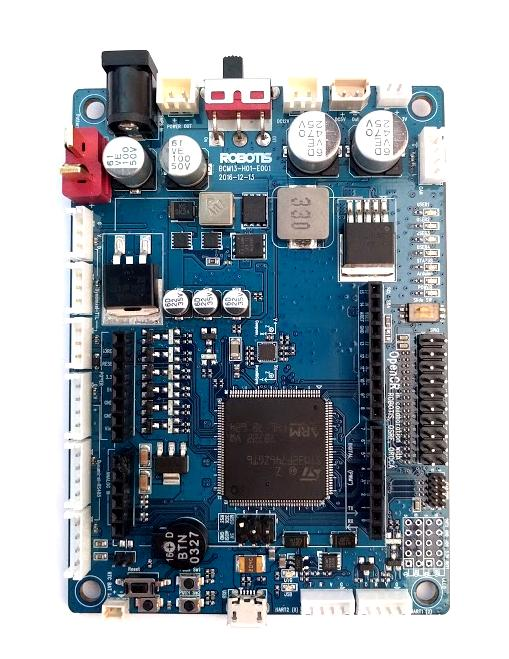
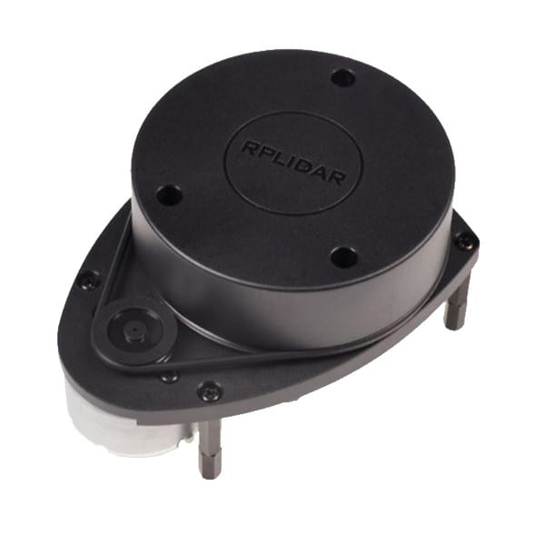
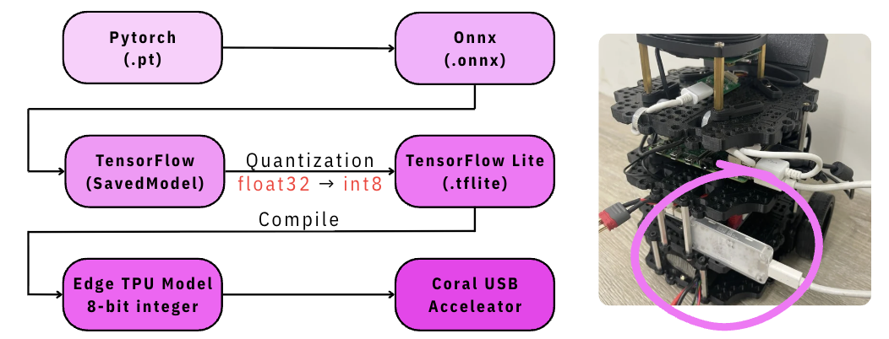
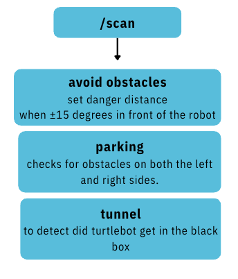
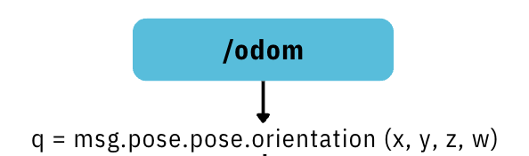
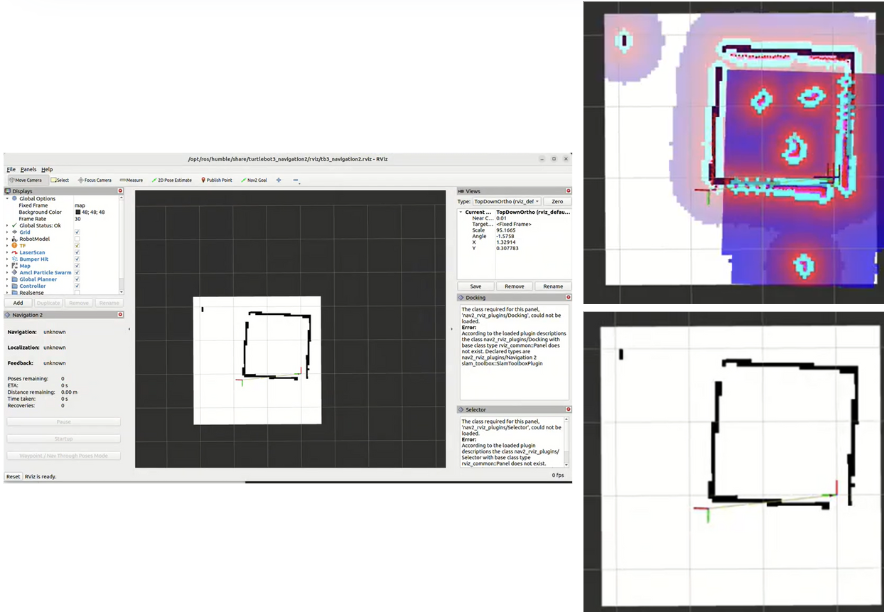

# AI-Minions-AMR
AI Minions AMR is an autonomous mobile robot based on the TurtleBot3 Burger platform.  
Its exterior design is inspired by the Minions, and it participated in the Autorace autonomous driving competition in 2025.

  

## Hardware Components Used in This Project:
#### OpenCR

   <em>Responsible for receiving ROS 2 commands and controlling the Dynamixel motors for low-level motion control.</em>

  

#### RPLIDAR-A1 

   <em>Used for 2D scanning, map construction (SLAM), and obstacle detection.</em>

  

#### Logitech c9301

   <em>The main visual input source, supporting 640×480 resolution for image recognition and lane tracking.</em>

 

#### Dynamixel XL430-W250-T

   <em>Provides high-precision and stable actuation, serving as the primary driving force of the TurtleBot3.</em>

 

#### LiPo Battery

   <em>Supplies stable power to the Raspberry Pi and OpenCR.</em>

  

#### Raspberry Pi 4

   <em>Executes perception, navigation, and control nodes, acting as the computational core of the entire system.</em>

  

## Software Tools Used in This Project:
| Software / Tool                 | Purpose                                                                 |
| ------------------------------ | ------------------------------------------------------------------------ |
| **Ubuntu 22.04 LTS**           | Operating system                                                         |
| **ROS2 Humble**                | Robotics development framework for perception, navigation, and task integration |
| **Python 3.10**                | Primary programming language                                             |
| **OpenCV 4.11.0.86**           | Image processing and preprocessing                                       |
| **YOLOv5 (RTX 3060 Ti)**       | Used for training the image recognition model, including 13 classes and 2,112 images, with dataset annotation completed using Roboflow |
| **Rviz2**                      | ROS2 visualization tool for monitoring maps, coordinates, and paths     |
| **SLAM**                       | Environment mapping to support localization and navigation               |
| **Gazebo**                     | Simulation environment combined with `turtlebot3_world` for early-stage testing and algorithm verification |
| **VSCode + Colcon Workspace**  | Development and build environment supporting multi-package builds and real-time debugging |

## 🧠 Object Detection
The image below demonstrates the results of object detection using our YOLOv5 model.  
In real-world testing, the model maintains high accuracy and precision across various scenarios,  
effectively recognizing intersections, signs, and specific colored lane markings within the Autorace track.

  

We chose YOLOv5 primarily because it achieves an excellent balance between accuracy and portability.  
After training, the model was converted into a TensorFlow Lite (TFLite) INT8 quantized format.  
This significantly reduces computational cost and CPU load, allowing the Raspberry Pi 4 to perform real-time inference smoothly  
without overheating or latency issues.

    <em>Model conversion pipeline: YOLOv5 → ONNX → TensorFlow → TFLite (INT8)</em> 
 

## 🎥 Camera Calibration
Due to the original limited field of view (FOV) of the robot’s camera, a wide-angle lens was added to expand the visible area.  
However, wide-angle lenses often introduce edge distortion. Therefore, camera calibration was applied to correct image distortion,  
ensuring accurate scale and perspective.

    <em>Before calibration (left) ⬅️ After calibration (right) ➡️</em> 
 

## 🎛️ HSV Range Tuning UI
To accurately detect lane colors, we designed a simple UI that allows dynamic adjustment of HSV color ranges using sliders.  
By selecting a Region of Interest (ROI), we can quickly extract the HSV ranges for “yellow” and “white” lanes.

   For the “yellow” region, the Hue value is set more strictly to reduce lighting interference.  <em>For the “white” region, stricter constraints are applied to Saturation and Value.</em> 
 
The HSV color space was chosen because it separates color information from brightness,  
allowing the system to remain stable under varying lighting conditions.

## 🛣️ Lane Following
A Region of Interest (ROI) is defined within the image, and HSV thresholds are applied to generate two masks: “yellow” and “white”.

 
 
The yellow mask focuses on the left half of the ROI;  
the white mask focuses on the right half of the ROI.  
The system computes the centroid of each mask, estimates the lane center and deviation (error),  
and applies a proportional controller (P-Control) for correction.

## 📡 Sensor Integration
The system integrates multiple ROS topics simultaneously:

    <em>/scan: Used for obstacle avoidance, stopping, and black-box area detection.</em>
 

    <em>/odom: Provides robot position and orientation data, supporting precise distance and rotation control.</em> 
 

## 🧭 Navigation

  
  
During the navigation phase, an initial blank map containing black-box locations is created.  
After launch, the system automatically generates a costmap and performs autonomous path planning.  
Users only need to specify the target Position and Orientation via commands,  
and the robot will autonomously plan its route and reach the destination.
